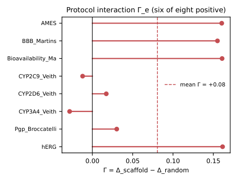

# ADMET-MTL-Diagnostic

**A Leakage-Controlled Diagnostic Study of How Evaluation Protocols Shape the Apparent Benefits of Hard-Sharing Multi-Task Learning in ADMET Prediction**

A leakage-controlled diagnostic study of **when and why** hard-sharing multi-task learning (MTL) helps ADMET prediction — and when it doesn't.

[](https://www.python.org/)
[](LICENSE)
[](https://pytorch.org/)
[](https://www.rdkit.org/)

---

## 📌 Key Findings

| # | Finding | Result |
|---|---------|--------|
| 1 | **MTL advantage is protocol-dependent** | Log-loss contrast Δ = +0.321 (random) vs +0.402 (scaffold); **Γ = +0.081**, paired t₇ = 2.65 (p = 0.033), molecule-cluster bootstrap 95% CI [+0.079, +0.083], leave-one-endpoint-out +0.069–+0.096 (6/8 endpoints positive, small-endpoint driven) |
| 2 | **The advantage is temperature-correctable** | Strict per-model temperature calibration (T fitted on each model's own 10% calibration partition, applied to its own test partition) attenuates Δ to ≈ 0 under both protocols (Δ_cal = −0.003 / +0.003, Γ_cal = +0.006, p = 0.45) — the gain reflects *raw logit scale*, not ranking information or durable calibration |
| 3 | **No systematic novelty dependence under the confirmatory design** | Flat under both protocols at 5 instances × 3 seeds; an apparent reversal in a 3-instance development analysis did not survive the larger design |
| 4 | **Cross-task identity exposure is a real failure mode** | Per-endpoint splits let test molecules reach MTL through auxiliary endpoints; global molecule allocation controls it |
| 5 | **Protocol interaction is cross-architecture** | Reproduced with a GIN at matched scale (5 instances × 3 seeds): Γ = +0.026, bootstrap 95% CI [+0.007, +0.046] — direction not representation-specific |

## 🧪 Experimental Framework


Eight binary ADMET endpoints (TDC) are globally partitioned under **grouped random** and **Bemis–Murcko scaffold** allocation, with no cross-task identity exposure. Hard-sharing MTL (task-balanced) is compared against **architecture-matched STL** via a molecule-level log-loss contrast.

## 📊 Main Results

### Per-endpoint contrast under both protocols


### Protocol interaction Γ



### Temperature calibration: the advantage disappears


| Endpoint | Δ (random) | Δ (scaffold) | Γ_e | AUROC STL→MTL |
|----------|-----------|-------------|-----|---------------|
| hERG | +0.36 | +0.52 | +0.16 | 0.836 → 0.835 |
| AMES | +0.34 | +0.50 | +0.16 | 0.876 → 0.868 |
| BBB_Martins | +0.26 | +0.41 | +0.16 | 0.890 → 0.889 |
| Pgp_Broccatelli | +0.33 | +0.36 | +0.03 | 0.922 → 0.938 |
| CYP2C9_Veith | +0.29 | +0.28 | −0.01 | 0.868 → 0.853 |
| CYP2D6_Veith | +0.22 | +0.24 | +0.02 | 0.839 → 0.829 |
| CYP3A4_Veith | +0.36 | +0.34 | −0.03 | 0.877 → 0.875 |
| Bioavailability_Ma | +0.41 | +0.57 | +0.16 | 0.734 → 0.733 |

## 🗂 Repository Structure

```
ADMET-MTL-Diagnostic/
├── data/          # TDC data download scripts (versioned)
├── splits/        # Global molecule-partition manifests (random + scaffold × 5 instances)
├── models/        # b3_config.py, b3_main_experiment.py (R1: grouped random),
│                  # b3_supplement.py (S1–S4: scaffold / downsampling / Brier)
├── calibration/   # Nested temperature calibration (per run / endpoint)
├── analysis/      # Novelty, AUC/Brier decomposition, within-endpoint models, figures
├── results/       # Per-endpoint prediction tables and summaries
├── docs/figures/  # Paper figures (PNG)
└── LICENSE        # MIT
```

## 🚀 Quick Start

```bash
# 1. Install (verified environment: Python 3.10, RDKit 2026.03.4,
#    PyTorch 2.13.0+cu130, single RTX 4070 Ti SUPER GPU)
pip install -r requirements.txt

# 2. Download TDC ADMET datasets
#    (hERG, AMES, BBB_Martins, Pgp_Broccatelli, CYP2C9/2D6/3A4_Veith, Bioavailability_Ma)
#    via tdc.single_pred into data/

# 3. Run the diagnostic (R1: grouped random protocol, leakage-controlled)
python models/b3_main_experiment.py

# 4. Run supplementary experiments (scaffold protocol, downsampling, Brier)
python models/b3_supplement.py

# 5. Analyze (novelty axis, AUC/Brier decomposition)
python analysis/b3_r2_analysis.py
python analysis/b3_r2b_analysis.py

# 6. Generate figures
python analysis/b3_figures.py
```

Split manifests and seeds are fixed in `models/b3_config.py` (5 instances × 3 seeds, global three-way 70/10/20 train/calibration/test molecule allocation).

## 🧠 Method

- **Estimand**: molecule-level log-loss contrast `ΔNLL = NLL_STL − NLL_MTL` (positive favors MTL), endpoint-macro aggregate, protocol contrast `Γ = Δ_scaffold − Δ_random`
- **Leakage control**: global molecule allocation — a test molecule cannot appear in any auxiliary endpoint's training partition
- **Calibration**: strict per-model temperature scaling (T fitted on each trained model's own 10% calibration partition, applied to its own test partition), per endpoint / split / seed / protocol / model
- **Novelty axis**: target-relative novelty = 1 − max Tanimoto to the *target endpoint's* training molecules

## 📄 Citation

```bibtex
@misc{admet_mtl_diagnostic_2026,
  title = {A Leakage-Controlled Diagnostic Study of How Evaluation Protocols Shape the Apparent Benefits of Hard-Sharing Multi-Task Learning in ADMET Prediction},
  author = {Functionhx},
  year = {2026},
  howpublished = {GitHub repository},
  url = {https://github.com/Functionhx/ADMET-MTL-Diagnostic}
}
```

## 📜 License

MIT — see [LICENSE](LICENSE).
