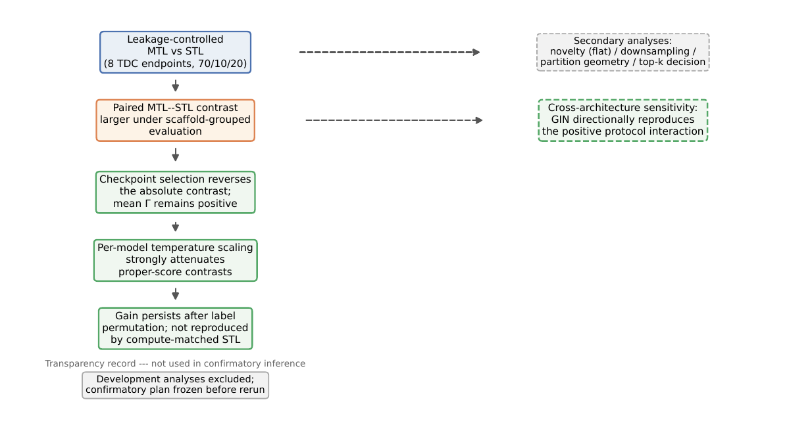
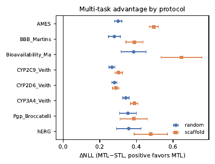
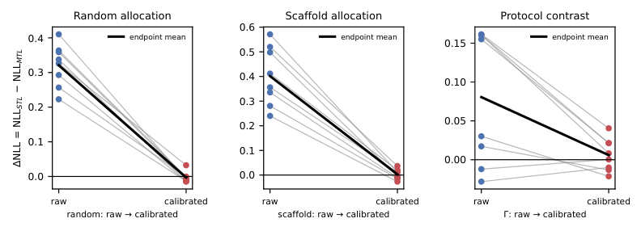

# ADMET-MTL-Diagnostic

**A Leakage-Controlled Diagnostic Study of How Evaluation Protocols Shape the Apparent Benefits of Hard-Sharing Multi-Task Learning in ADMET Prediction**

A leakage-controlled diagnostic study of **when and why** hard-sharing multi-task learning (MTL) helps ADMET prediction — and when it doesn't.

[](https://www.python.org/)
[](LICENSE)
[](https://pytorch.org/)
[](https://www.rdkit.org/)
[](https://github.com/Functionhx/ADMET-MTL-Diagnostic/releases/tag/v1.0.0)

---

## 📌 Key Findings

| # | Finding | Result |
|---|---------|--------|
| 1 | **MTL advantage is protocol-dependent** | Log-loss contrast Δ = +0.321 (random) vs +0.402 (scaffold); **Γ = +0.081**, paired t₇ = 2.65 (p = 0.033); layered uncertainty: molecule CI [+0.079, +0.083], split-instance block CI [+0.048, +0.112], endpoint-resample CI [+0.026, +0.138] (all exclude zero); 6/8 endpoints positive, small-endpoint concentrated |
| 2 | **The advantage is temperature-correctable** | Strict per-model temperature calibration (T fitted on each model's own 10% calibration partition, applied to its own test partition; 480 per-run fits, none at the bounds) attenuates Δ to ≈ 0 under both protocols (Δ_cal = −0.003 / +0.003, Γ_cal = +0.006, p = 0.45) |
| 3 | **Not an optimization-budget effect** | Compute-matched STL (8× updates, 15 runs) is *worse* than standard STL (−0.096); MTL beats STL-8× by +0.396 |
| 4 | **Not task-specific label transfer** | Fully permuted auxiliary labels (target-specific, 9 runs) leave the gain essentially unchanged (Δ = +0.293 vs +0.300); pooled pretrain + STL fine-tune retains only +0.045 → the gain lives in *joint optimization of the shared representation* |
| 5 | **No systematic novelty dependence** | Flat under both protocols at 5 instances × 3 seeds; an apparent reversal in a 3-instance development analysis did not survive the larger design |
| 6 | **Cross-task identity exposure is a real failure mode** | Per-endpoint splits let test molecules reach MTL through auxiliary endpoints; global molecule allocation controls it |
| 7 | **Protocol interaction is cross-architecture** | Positive direction reproduced in a matched-scale GIN sensitivity analysis (5 instances × 3 seeds): Γ = +0.026, bootstrap 95% CI [+0.007, +0.046] |

## 🧪 Experimental Framework



Eight binary ADMET endpoints (TDC) are globally partitioned into **70% train / 10% calibration / 20% test** under **grouped random** and **Bemis–Murcko scaffold** allocation (5 instances × 3 seeds), with no cross-task identity exposure. Hard-sharing MTL (task-balanced) is compared against **architecture-matched STL** via a molecule-level log-loss contrast.

## 🚀 Reproduce Everything

```bash
# 1. Environment (verified: Python 3.10, RDKit 2023.09.6, PyTorch 2.13.0+cu130, RTX 4070 Ti SUPER)
pip install -r requirements.txt

# 2. Download the eight TDC ADMET datasets
python scripts/download_data.py          # -> data/<Endpoint>.csv

# 3. Main confirmatory experiment (random + scaffold, 70/10/20, ~25 min on one GPU)
python models/b3_main_v2.py              # -> results/b3_v2_{random,scaffold}_di.parquet

# 4. Downsampling intervention (scaffold protocol, CYP endpoints → 2,000 molecules)
python models/b3_ds_v2.py                # -> results/b3_v2_scaffold_ds_di.parquet

# 5. Mechanistic controls (label-permuted MTL, target-specific; ~3 min)
python models/b3_controls_v2.py          # -> results/control_v2_di.parquet

# 6. Compute-matched STL-8x baseline (~20 min)
python models/b3_stl8x.py                # -> results/stl8x_di.parquet

# 7. GNN sensitivity analysis (5 instances × 3 seeds, ~90 min)
python models/b3_gnn_baseline.py         # -> results/b3_gnn_results.parquet

# 8. Reviewer analyses (layered bootstrap, novelty matching, top-k, calibration diagnostics)
python analysis/b3_r2c_reviewer_analysis.py v2   # -> results/r2c/*.csv

# 9. Figures
python analysis/b3_figures_v3.py         # -> paper figures (PDF)
```

All prediction tables, per-molecule contrasts, split manifests, and analysis outputs are already committed under `results/` and `splits/` — you can inspect them without rerunning anything.

## 📊 Main Results

### Per-endpoint contrast under both protocols



### Temperature calibration: the advantage disappears



| Endpoint | Δ (random) | Δ (scaffold) | Γ_e | AUROC STL→MTL |
|----------|-----------|-------------|-----|---------------|
| hERG | +0.36 | +0.52 | +0.16 | 0.836 → 0.835 |
| AMES | +0.34 | +0.50 | +0.16 | 0.876 → 0.868 |
| BBB Martins | +0.26 | +0.41 | +0.16 | 0.890 → 0.889 |
| P-gp Broccatelli | +0.33 | +0.36 | +0.03 | 0.922 → 0.938 |
| CYP2C9 Veith | +0.29 | +0.28 | −0.01 | 0.868 → 0.853 |
| CYP2D6 Veith | +0.22 | +0.24 | +0.02 | 0.839 → 0.829 |
| CYP3A4 Veith | +0.36 | +0.34 | −0.03 | 0.877 → 0.875 |
| Bioavailability Ma | +0.41 | +0.57 | +0.16 | 0.734 → 0.733 |

## 🗂 Repository Structure

```
ADMET-MTL-Diagnostic/
├── models/        # All training scripts (v2 confirmatory design)
│   ├── b3_main_v2.py        # Main experiment (random + scaffold, 70/10/20)
│   ├── b3_ds_v2.py          # Downsampling intervention
│   ├── b3_controls_v2.py    # Label-permuted MTL control (target-specific)
│   ├── b3_stl8x.py          # Compute-matched STL-8x baseline
│   ├── b3_gnn_baseline.py   # GIN sensitivity (5×3)
│   └── b3_config.py         # Frozen configuration
├── analysis/      # b3_r2c_reviewer_analysis.py, b3_figures_v3.py, ...
├── results/       # Prediction tables + per-molecule contrasts (parquet)
├── splits/        # Global 70/10/20 partition manifests (random + scaffold × 5 instances)
├── data/          # TDC datasets (download via scripts/download_data.py)
├── protocol/      # Frozen confirmatory plan, deviations log, post hoc analyses
├── docs/          # Manuscript PDF, figures, PROTOCOL.md
└── LICENSE        # MIT
```

## 🧠 Method

- **Estimand**: molecule-level log-loss contrast `ΔNLL = NLL_STL − NLL_MTL` (positive favors MTL), endpoint-macro aggregate, protocol contrast `Γ = Δ_scaffold − Δ_random`
- **Leakage control**: global three-way molecule allocation (70/10/20 train/calibration/test) — a test molecule cannot appear in any endpoint's training or calibration partition
- **Calibration**: strict per-model temperature scaling (T fitted on each trained model's own calibration partition, applied to its own test partition), per endpoint / split / seed / protocol / model; 480 per-run fits, none at the [0.2, 5.0] bounds
- **Controls**: compute-matched STL-8× (budget), target-specific label permutation (label transfer), pooled pretrain + STL fine-tune (joint training), novelty-distribution reweighting (partition geometry)
- **Novelty axis**: target-relative novelty = 1 − max Tanimoto to the *target endpoint's* training molecules

## 📜 Protocol & Reproducibility

- **Frozen plan**: `protocol/final_confirmatory_plan.md` + `docs/PROTOCOL.md` (commit 5c2cd1e, 2026-08-03)
- **Deviations** from the development design: `protocol/deviations.md`
- **Post hoc analyses** (labeled exploratory): `protocol/posthoc_analyses.md`
- **Environment pinned**: `requirements.txt` (Python 3.10, PyTorch 2.13.0+cu130, RDKit 2023.09.6)
- **Frozen snapshot**: [release v1.0.0](https://github.com/Functionhx/ADMET-MTL-Diagnostic/releases/tag/v1.0.0) · [](https://doi.org/10.5281/zenodo.21772294)

## 📄 Citation

```bibtex
@misc{admet_mtl_diagnostic_2026,
  title = {A Leakage-Controlled Diagnostic Study of How Evaluation Protocols Shape the Apparent Benefits of Hard-Sharing Multi-Task Learning in ADMET Prediction},
  author = {Fan, Yuchen},
  year = {2026},
  howpublished = {GitHub repository},
  url = {https://github.com/Functionhx/ADMET-MTL-Diagnostic},
  doi = {10.5281/zenodo.21772295}
}
```

## 📜 License

MIT — see [LICENSE](LICENSE).
